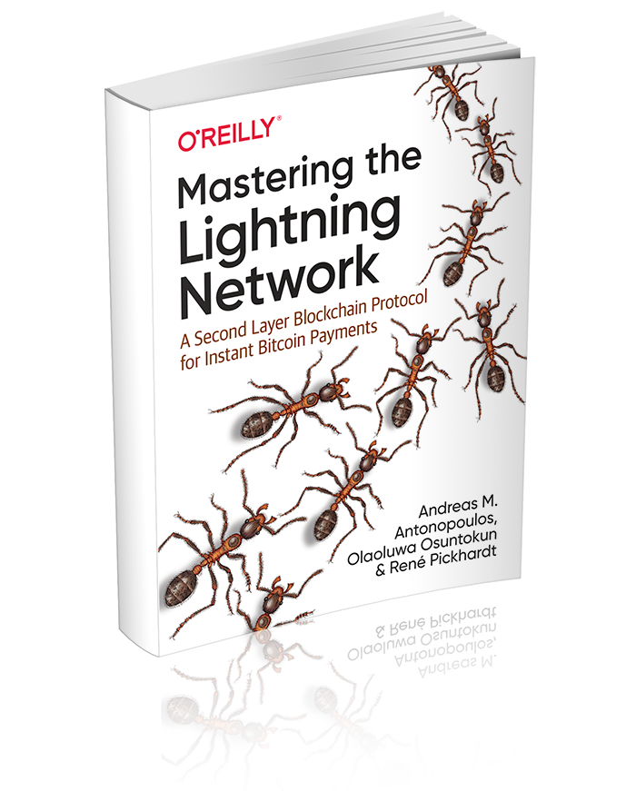

# Mastering the Lightning Network

## About
Mastering the Lightning Network is an O'Reilly Media book, due for publication in Q4'2021, and announced in August 2019  by authors Andreas M. Antonopoulos ([@aantonop](https://twitter.com/aantonop)), Olaoluwa Osuntokun ([@roasbeef](https://twitter.com/roasbeef)), Rene Pickhardt ([@renepickhardt](https://twitter.com/renepickhardt)).

The book describes the Lightning Network (LN), a Peer-to-Peer protocol running on top of Bitcoin and other blockchains, which provides near-instant, secure, micro-payments.

The book is suitable for technical readers with an understanding of the fundamentals of Bitcoin and other open blockchains.

## Status

The current status of the book is "RELEASE PREP". See below for status of specific chapters and read the contribution guide to learn how and where to contribute.

### Legend

* :arrows_clockwise:  LIVE EDITS - Continuously changing: Submit focused/small Issues and PRs
* :mag: REVIEW - Ready for review: Submit Issues and PRs as needed
* :lock_with_ink_pen: EARLY DRAFT - In progress, changing often: Submit issues only, NO PRs or fixes
* :bookmark_tabs: OUTLINE - Rough outline - Please contribute! PRs welcome.
* :thought_balloon: PLANNED - Planned section  - Do nothing yet.
* :heavy_check_mark: DRAFT PUBLISHED - Published in early release - Copy edit only.

| Section | Length (Word Count) |  Status |
|-------|------|:------:|
| PART 1 | PART 1 | PART 1 |
| [Preface and Acknowledgments](preface.asciidoc) | #### | :heavy_check_mark: |
| [Glossary](glossary.asciidoc) | ############## | :arrows_clockwise: |
| [Introduction](01_introduction.asciidoc) | ########## | :heavy_check_mark: |
| [Getting Started](02_getting_started.asciidoc) | ############# | :heavy_check_mark: |
| [LN Basics (How LN Works)](03_how_ln_works.asciidoc) | ########################### | :heavy_check_mark: |
| [Nodes (LN Clients)](04_node_client.asciidoc) | #################### | :heavy_check_mark: |
| [Operating a Node](05_node_operations.asciidoc) | ############################ | :heavy_check_mark: |
| PART 2 | PART 2 | PART2 |
| [Lightning Architecture](06_lightning_architecture.asciidoc) | # | :heavy_check_mark: |
| [Payment Channels in Detail](07_payment_channels.asciidoc) | ################### | :heavy_check_mark: |
| [Routing (HTLCs)](08_routing_htlcs.asciidoc) | ################ | :heavy_check_mark: |
| [Channel operation and HTLC settlement](09_channel_operation.asciidoc) | ####### | :heavy_check_mark: |
| [Onion Construction and Routing](10_onion_routing.asciidoc) | ############### | :heavy_check_mark: |
| [Channel Graph and Gossip Layer](11_gossip_channel_graph.asciidoc) | ############ | :heavy_check_mark: |
| [Payment Path Finding](12_path_finding.asciidoc) | ############# | :lock_with_ink_pen: |
| [LN Security and Privacy](13_security_privacy_ln.asciidoc) | ################ | :lock_with_ink_pen: |
| APPENDICES | APPENDICES | APPENDICES |
| [A1 - Bitcoin Fundamentals Review](appendix-bitcoin-fundamentals-review.asciidoc) | ########### | :heavy_check_mark: |
| [An - License Notices](appendix_license_notices.asciidoc) | # | :heavy_check_mark: |

Total Word Count: 102601

Target Word Count: 100,000-120,000

## Contributing

The authors welcome contributions to this book! Read the [Guide to Contributing](CONTRIBUTING.md)

## Source and license

Mastering the Lightning Network is released under the Creative Commons CC-BY-NC-ND license, which allows sharing the source code for personal use only. You may read this book for free. You may not create derivatives (such as PDF copies), or distribute the book commercially. The full terms of the license can be found here:

Mastering the Lightning Network by <a xmlns:cc="http://creativecommons.org/ns#" href="https://lnbook.info/" property="cc:attributionName" rel="cc:attributionURL">Andreas M. Antonopoulos, Olaoluwa Osuntokun, Rene Pickhardt</a> is licensed under a <a rel="license" href="http://creativecommons.org/licenses/by-nc-nd/4.0/">Creative Commons Attribution-NonCommercial-NoDerivatives 4.0 International License</a>.

It is expected that the book will be released under a more permissive CC-BY-SA license within a year of publication.
